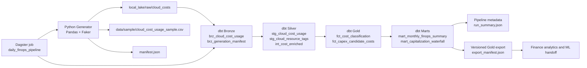
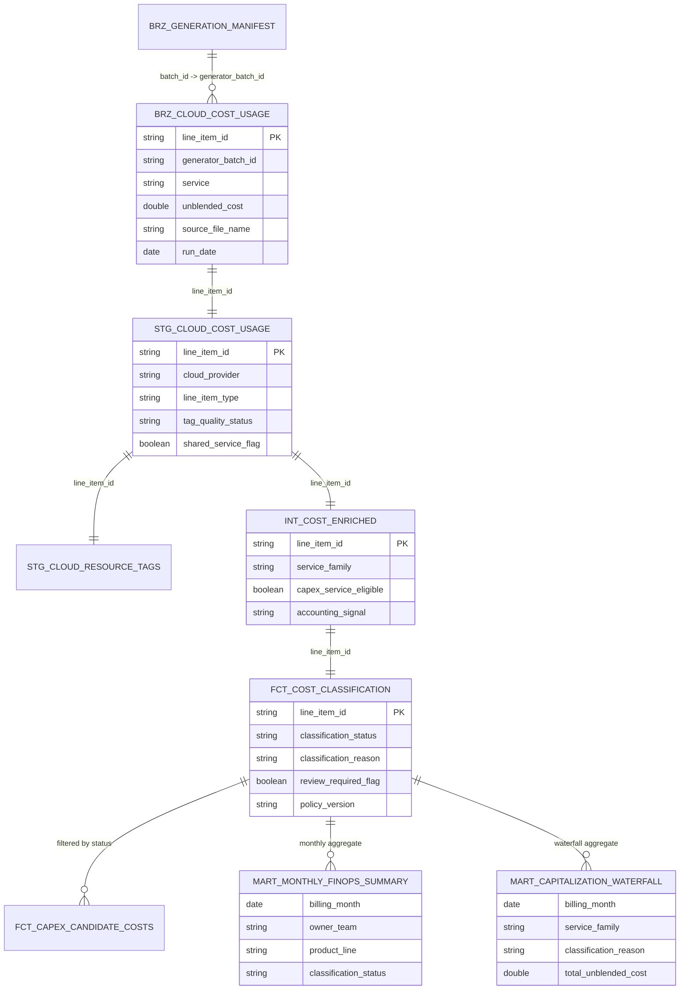

# finops-cost-capitalization-pipeline

[](https://github.com/brunoramosmartins/finops-cost-capitalization-pipeline/actions/workflows/ci.yml)
[](https://www.python.org/downloads/)
[](https://www.getdbt.com/)
[](https://duckdb.org/)
[](./LICENSE)

Portfolio-grade Analytics Engineering project that simulates cloud billing data,
builds a local-first FinOps pipeline, and implements an explainable OPEX versus
CAPEX recommendation layer on top of a Bronze, Silver, Gold architecture.

## Project Snapshot

- Phase 1 implemented: repository foundation, synthetic billing generation, local data lake
- Phase 2 implemented: DuckDB warehouse, dbt Bronze/Silver/Gold models, finance-facing marts
- Phase 3 implemented: stronger dbt quality tests, Dagster orchestration, local pipeline metadata, and CI/CD hardening
- Phase 4 implemented: versioned Gold exports and formal ML handoff contract
- Local validation completed: generator, `pytest`, `dbt seed`, `dbt run`, `dbt test`, and Gold export
- Current output: each raw billing line is classified into `opex`, `capex_eligible`, `shared_cost_review`, or `unclassified`

## Why This Repository Exists

This project is designed to demonstrate:

- Analytics Engineering with `dbt` and DuckDB
- synthetic data generation with realistic operational and financial behavior
- FinOps reasoning expressed as reproducible SQL logic
- portfolio-grade documentation, repository hygiene, and CI discipline
- a clean downstream bridge into a future ML forecasting repository

## Current Status

Phases 1, 2, 3, and 4 are implemented as the repository foundation, synthetic
data generation layer, local dbt transformation stack, quality-orchestrated
execution layer, and versioned export handoff for downstream ML work.
The project currently provides:

- a documented repository structure and contribution workflow
- assistant guidance under `docs/assistant/`
- project-specific Codex skills under `.agents/skills/`
- a synthetic cloud billing generator implemented in Python
- partitioned raw output in a mock local data lake
- a raw data contract for downstream Bronze ingestion
- a local DuckDB + dbt project for Bronze, Silver, Gold, and mart models
- a Dagster job definition for scheduled local execution
- pipeline run summaries under `local_lake/metadata/pipeline_runs/`
- GitHub Actions that validate Python quality, SQL linting, and dbt execution
- versioned Gold exports under `local_lake/gold/ml_handoff/`
- a downstream ML handoff contract and repository boundary documentation

## Architecture



The warehouse model can also be opened in `dbdiagram.io` using
[`docs/diagrams/warehouse_schema.dbml`](docs/diagrams/warehouse_schema.dbml).

## Data Model Overview



Current analytical outputs include:

- raw provider-like billing drops in Parquet
- Bronze ingestion models in dbt
- Silver standardization and metadata quality signals
- Gold accounting recommendation facts
- monthly finance-facing marts
- versioned Parquet exports for downstream forecasting

## Quick Start

1. Create a Python virtual environment.
2. Install dependencies:

```bash
pip install -e ".[dev]"
```

3. Generate a raw synthetic billing batch:

```bash
finops-generate --days 365 --output-format parquet
```

4. Run tests:

```bash
pytest
```

5. Run the dbt transformation stack:

```bash
export DBT_PROFILES_DIR="$(pwd)/dbt"
dbt seed --project-dir dbt
dbt run --project-dir dbt
dbt test --project-dir dbt
```

6. Or run the full local pipeline in one command:

```bash
finops-run-pipeline --days 90
```

7. Export the Gold product independently when needed:

```bash
finops-export-gold --snapshot-date 2026-04-06
```

8. Validate a few warehouse outputs:

```bash
python -c "import duckdb; con=duckdb.connect('warehouse/finops.duckdb'); print(con.execute('show all tables').fetchdf())"
python -c "import duckdb; con=duckdb.connect('warehouse/finops.duckdb'); print(con.execute('select classification_status, count(*) from analytics_gold.fct_cost_classification group by 1 order by 1').fetchdf())"
python -c "import duckdb; con=duckdb.connect('warehouse/finops.duckdb'); print(con.execute('select * from analytics_marts.mart_monthly_finops_summary order by billing_month, classification_status limit 20').fetchdf())"
```

For the latest validated local run, both Bronze and Gold materialized the same
line count, confirming that every raw billing line reached the classification
layer.

## What You Should Have After Phase 4

- raw Parquet and manifest files under `local_lake/raw/cloud_costs/run_date=.../`
- local DuckDB warehouse at `warehouse/finops.duckdb`
- dbt schemas: `analytics_reference`, `analytics_bronze`, `analytics_silver`, `analytics_gold`, and `analytics_marts`
- classification outputs that separate direct operational spend from CAPEX candidates and review-required shared costs
- run metadata under `local_lake/metadata/pipeline_runs/run_date=.../run_summary.json`
- versioned Gold exports under `local_lake/gold/ml_handoff/version=vX.Y.Z/snapshot_date=.../`

## Repository Highlights

- `src/finops_capex/`: Python package for generation, ingestion, and utilities
- `dbt/`: local transformation project for Bronze, Silver, Gold, and marts
- `orchestration/dagster_project/`: Dagster job and schedule definitions
- `data/contracts/`: formal data contracts
- `docs/`: architecture, policy, execution, and contribution guidance
- `docs/diagrams/`: reusable architecture and warehouse diagrams
- `.agents/skills/`: Codex-oriented reusable project skills

## Repository Guide

- [ROADMAP.md](ROADMAP.md): full phased project plan
- [docs/architecture.md](docs/architecture.md): architectural notes
- [docs/diagrams/warehouse_schema.dbml](docs/diagrams/warehouse_schema.dbml): dbdiagram-compatible warehouse model
- [docs/contributing.md](docs/contributing.md): local development workflow
- [docs/assistant/project_context.md](docs/assistant/project_context.md): assistant-facing project context
- [data/contracts/raw_cloud_cost_usage.yml](data/contracts/raw_cloud_cost_usage.yml): raw data contract
- [data/contracts/gold_ml_handoff.yml](data/contracts/gold_ml_handoff.yml): downstream ML export contract
- [docs/ml_handoff.md](docs/ml_handoff.md): Project 2 bootstrap and ownership boundary
- [docs/runbooks/dbt_local_execution.md](docs/runbooks/dbt_local_execution.md): dbt execution guide
- [docs/runbooks/ci_cd.md](docs/runbooks/ci_cd.md): CI and validation runbook
- [docs/runbooks/incident_response.md](docs/runbooks/incident_response.md): failure investigation guide

## Portfolio Framing

This repository intentionally emphasizes:

- explicit roadmap-driven execution
- documentation that stays close to implementation
- explainable financial rules instead of opaque heuristics
- local reproducibility before cloud complexity
- clean boundaries between Analytics Engineering and future MLOps work

## Roadmap

See [ROADMAP.md](ROADMAP.md) for the full project plan, including phases,
milestones, issue catalog, architecture, and the ML handoff strategy.

## GitHub Bootstrap

Use the Bash automation scripts to prepare the remote GitHub repository with
labels, milestones, and issues derived from the roadmap.

```bash
bash scripts/setup_labels.sh --repo owner/repo
bash scripts/setup_milestones.sh --repo owner/repo
bash scripts/setup_issues.sh --repo owner/repo
bash scripts/setup_all.sh --repo owner/repo
```

The issue bootstrap reads the issue catalog directly from `ROADMAP.md`, so the
roadmap remains the single source of truth for backlog creation.
