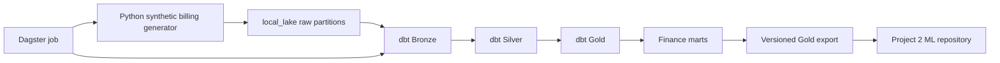

# finops-cost-capitalization-pipeline

[](https://github.com/brunoramosmartins/finops-cost-capitalization-pipeline/actions/workflows/ci.yml)
[](https://www.python.org/downloads/)
[](https://www.getdbt.com/)
[](https://duckdb.org/)
[](./LICENSE)

Portfolio-grade Analytics Engineering and FinOps project that simulates cloud billing, builds a local-first Bronze/Silver/Gold pipeline, and produces an explainable OPEX vs CAPEX recommendation layer ready for downstream forecasting.

## Executive Summary

This repository answers a practical FinOps question:

> How do you turn noisy cloud billing data into a governed analytical product that finance, engineering, and a downstream ML system can trust?

The solution implemented here is a local-first analytics pipeline that:

- generates provider-like cloud billing data with realistic cost, usage, tag, and discount behavior,
- lands raw files in a partitioned local lake,
- transforms them with `dbt` and DuckDB through Bronze, Silver, Gold, and mart layers,
- applies explainable accounting rules to classify each billing line,
- exports versioned Gold snapshots for a second ML repository.

The main business output is not the raw data. The main output is a governed Gold data product that labels each billing line as:

- `opex`
- `capex_eligible`
- `shared_cost_review`
- `unclassified`

## Why This Project Matters

Cloud billing records are operationally detailed but financially ambiguous. A finance team may need to know:

- which costs should remain operational expense,
- which technology build costs may be capitalized,
- which shared or weakly tagged costs require manual review,
- which curated outputs are safe to use for forecasting and reporting.

This repository demonstrates how to build that analytical layer with:

- `dbt` and DuckDB for Analytics Engineering,
- explicit accounting recommendation logic,
- versioned exports and data contracts,
- Dagster orchestration,
- CI validation across Python, SQL, and dbt,
- a clean handoff boundary to a second ML repository.

## What This Repository Produces

The implemented pipeline produces:

- raw billing drops in a local lake,
- Bronze ingestion models,
- Silver standardization and tag-quality signals,
- Gold classification facts,
- finance-facing marts,
- versioned export snapshots and manifests,
- pipeline metadata for observability and auditability.

At a high level:



## Example Outputs

The repository already contains evidence of a successful local pipeline run in:

- `local_lake/metadata/pipeline_runs/run_date=2026-04-06/run_summary.json`
- `data/sample/cloud_cost_usage_sample.csv`
- `data/sample/cloud_cost_usage_sample_manifest.json`

### Example run summary

From the latest committed local run metadata:

```json
{
  "status": "success",
  "run_date": "2026-04-06",
  "row_count": 1840,
  "latest_billing_month": "2026-04-01",
  "bronze_row_count": 1840,
  "gold_row_count": 1840
}
```

This is a strong integrity signal for the portfolio because Bronze and Gold reconciled to the same row count in that run.

### Example classification distribution

The same `run_summary.json` reports the following Gold classification counts:

| classification_status | row_count |
|---|---:|
| `shared_cost_review` | 936 |
| `opex` | 571 |
| `capex_eligible` | 232 |
| `unclassified` | 101 |

This is useful because it shows the project is not producing a trivial all-one-class output. The recommendation layer is creating a meaningful review surface for finance and FinOps workflows.

### Example raw billing line

One sample row from `data/sample/cloud_cost_usage_sample.csv` looks like this:

| field | value |
|---|---|
| `service` | `AWSDataTransfer` |
| `linked_account_id` | `222222222221` |
| `unblended_cost` | `10.8657` |
| `owner_team` | null |
| `environment` | `test` |
| `product_line` | `payments` |
| `capitalization_candidate` | `true` |
| `initiative_stage` | `implementation` |
| `asset_lifecycle` | `construction` |

That example illustrates the type of ambiguity this repository is built to handle: infrastructure cost data can contain partial ownership signals, operational context, and capitalization hints that need to be standardized and classified before they are analytically useful.

### Example batch manifest

The sample manifest records the generated batch boundary:

```json
{
  "batch_id": "batch-20260406T192644Z",
  "run_date": "2026-04-06",
  "row_count": 1840,
  "start_date": "2026-01-07",
  "end_date": "2026-04-06",
  "file_format": "parquet"
}
```

This gives the pipeline an auditable source boundary before dbt ingestion.

### Example Gold export manifest

After running:

```bash
finops-export-gold --snapshot-date 2026-04-06
```

the repository produced a versioned export manifest at:

- `local_lake/gold/ml_handoff/version=v0.4.0/snapshot_date=2026-04-06/export_manifest.json`

Snippet:

```json
{
  "export_version": "v0.4.0",
  "snapshot_date": "2026-04-06",
  "freshness_within_threshold": true,
  "latest_billing_month": "2026-04-01",
  "artifacts": [
    {
      "relation_name": "analytics_gold.fct_cost_classification",
      "row_count": 1840
    },
    {
      "relation_name": "analytics_gold.fct_capex_candidate_costs",
      "row_count": 232
    },
    {
      "relation_name": "analytics_marts.mart_monthly_finops_summary",
      "row_count": 72
    },
    {
      "relation_name": "analytics_marts.mart_capitalization_waterfall",
      "row_count": 112
    }
  ]
}
```

This is one of the strongest portfolio signals in the repository because it shows the project delivers a real versioned analytical interface for downstream ML consumption, not only internal warehouse models.

## Data Provenance

This repository uses synthetic billing data only.

That distinction is important:

- cloud billing rows are synthetic,
- account identifiers are synthetic,
- resource identifiers are synthetic,
- tags and ownership signals are synthetic,
- usage spikes, discounts, and credits are synthetic,
- transformation logic, accounting rules, contracts, tests, marts, and exports are real project artifacts.

So this is not a mixed real-plus-fake billing repository. It is a synthetic-source project with a real Analytics Engineering and FinOps workflow built on top of it.

That is intentional and portfolio-appropriate:

- no confidential billing data is required,
- the data model remains realistic,
- the engineering stack remains production-shaped,
- the repository can still support a serious downstream ML project.

## Portfolio Value

This project is stronger than a typical dashboard or notebook portfolio entry because it combines several layers of technical work in one coherent system:

- Analytics Engineering: Bronze, Silver, Gold, and mart modeling with `dbt`
- FinOps domain modeling: explainable OPEX vs CAPEX recommendation logic
- Data Product design: contracts, manifests, versioned exports, ownership boundaries
- Platform rigor: Dagster orchestration, pytest, SQL linting, CI workflows
- ML readiness: formal export contract for a second forecasting repository

The strongest way to present this repo in interviews is:

> I built the governed FinOps data product layer first, so that forecasting and MLOps could be developed on top of stable, versioned financial datasets instead of directly on noisy billing files.

## Current Scope

Implemented in this repository:

- synthetic billing generator in Python
- partitioned local-lake landing zone
- DuckDB warehouse
- dbt Bronze, Silver, Gold, and mart models
- accounting recommendation logic
- pipeline metadata publication
- versioned Gold export for ML handoff
- Dagster orchestration for local scheduled execution
- CI validation across Python and dbt surfaces

Explicitly out of scope for this repository:

- model training
- experiment tracking
- model serving
- production cloud deployment

Those are intentionally reserved for the downstream ML repository described in [docs/ml_handoff.md](docs/ml_handoff.md).

## Repository Walkthrough

Core implementation:

- `src/finops_capex/`: generator, ingestion, pipeline runtime, exports, and CLI entrypoints
- `dbt/`: Bronze, Silver, Gold, mart models, seeds, tests, and profiles
- `orchestration/dagster_project/`: Dagster jobs, schedules, and ops
- `conf/`: generator, pipeline, and policy configuration
- `data/contracts/`: raw and Gold export contracts

Project documentation:

- [ROADMAP.md](ROADMAP.md): full phased project plan
- [docs/architecture.md](docs/architecture.md): architecture notes
- [docs/accounting_policy.md](docs/accounting_policy.md): accounting and recommendation framing
- [docs/ml_handoff.md](docs/ml_handoff.md): Project 2 contract boundary
- [docs/runbooks/local_execution.md](docs/runbooks/local_execution.md): local execution guide
- [docs/runbooks/ci_cd.md](docs/runbooks/ci_cd.md): CI validation runbook
- [docs/runbooks/incident_response.md](docs/runbooks/incident_response.md): failure investigation guide
- [data/contracts/raw_cloud_cost_usage.yml](data/contracts/raw_cloud_cost_usage.yml): raw input contract
- [data/contracts/gold_ml_handoff.yml](data/contracts/gold_ml_handoff.yml): downstream Gold export contract

## Quick Start

Install dependencies:

```bash
pip install -e ".[dev]"
```

Generate a synthetic billing batch:

```bash
finops-generate --days 365 --output-format parquet
```

Run tests:

```bash
pytest
```

Run the full local pipeline:

```bash
finops-run-pipeline --days 90
```

Export the current Gold product:

```bash
finops-export-gold --snapshot-date 2026-04-06
```

For detailed execution steps, see [docs/runbooks/local_execution.md](docs/runbooks/local_execution.md).

## What "Done" Looks Like

From a portfolio perspective, this repository is successful when it shows:

- a reproducible synthetic source layer,
- a clean Bronze/Silver/Gold warehouse design,
- explainable financial classification logic,
- evidence of testing and CI discipline,
- a versioned export boundary for downstream ML work.

That is the standard this repository is aiming at, and the roadmap in [ROADMAP.md](ROADMAP.md) is aligned to that objective.

## GitHub Bootstrap

This repository includes automation scripts to create labels, milestones, and issues directly from the roadmap:

```bash
bash scripts/setup_labels.sh --repo owner/repo
bash scripts/setup_milestones.sh --repo owner/repo
bash scripts/setup_issues.sh --repo owner/repo
bash scripts/setup_all.sh --repo owner/repo
```

## License

MIT
