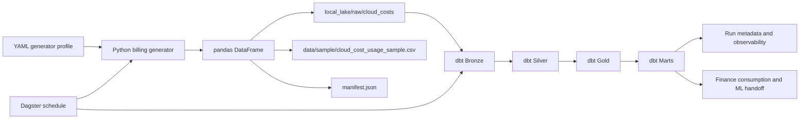

# Architecture

## Phase 1 Scope

Phase 1 establishes the repository foundation and the synthetic data generation
layer required for the rest of the pipeline.

Current implemented building blocks:

- repository-level standards and contribution guidance
- assistant guidance in `docs/assistant/`
- Codex-oriented reusable skills in `.agents/skills/`
- synthetic billing generator implemented in Python
- local mock data lake writer with batch manifest output
- raw data contract for downstream Bronze ingestion

## Phase 2 Scope

Phase 2 introduces the transformation layer:

- local DuckDB warehouse profile
- dbt project structure
- Bronze ingestion directly from raw Parquet files
- Silver standardization and tag normalization
- Gold accounting recommendation logic
- finance-facing marts

## Phase 3 Scope

Phase 3 adds operational rigor on top of the analytical stack:

- stronger dbt quality tests for row counts, reconciliation, and negative-cost rules
- local pipeline orchestration with Dagster
- run metadata publication for each execution
- CI jobs that validate Python, SQL, and dbt behavior together

## Data Flow

## Warehouse Model

The warehouse model is maintained in
[`docs/diagrams/warehouse_schema.dbml`](diagrams/warehouse_schema.dbml) so the
same structure can be opened directly in `dbdiagram.io` or kept versioned with
the rest of the repository.

Core lineage:

- `brz_cloud_cost_usage` and `brz_generation_manifest` ingest the raw lake partitions
- `stg_cloud_cost_usage` standardizes provider columns and computes tag quality signals
- `stg_cloud_resource_tags` exposes the normalized resource tagging slice
- `int_cost_enriched` joins billing lines to accounting policy defaults
- `fct_cost_classification` applies the OPEX versus CAPEX recommendation logic
- `fct_capex_candidate_costs` filters Gold to direct capitalization candidates
- `mart_monthly_finops_summary` and `mart_capitalization_waterfall` provide finance-facing aggregates

## Next Architectural Step

Phase 4 will publish versioned Gold exports and formalize the ML handoff
contract on top of the current quality-hardened analytics stack.
